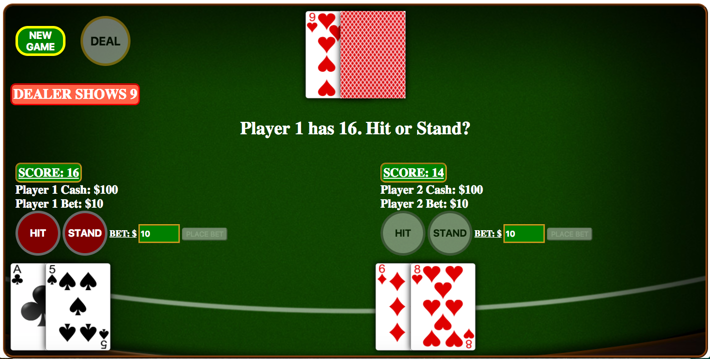

# **BLACKJACK**


A web based version of one of the world's most popular casino games. Also known as "twenty-one", two players take turns playing against the dealer trying to score 21 without going over.

<a href="https://dmacauyag.github.io/WDI-45-Project_1/">CLICK HERE</a> to play Blackjack!

## How to play:
At the beginning of the game, the dealer and each player are each dealt two cards. The dealer keeps one card face up and the other face down. 

The object of the game is for each player to beat the dealer in one of three ways:

* Obtain a score of 21 without the dealer scoring 21
* Obtain a higher score than the dealer without going over 21
* Force the dealer to draw cards until they get a score over 21

The point value for each card is as follows:

* Face cards are worth 10 points
* Numeric cards are worth the same amount of points as shown on the card
* Aces can be counted as either 1 or 11

Each player starts the game with $100. Prior to dealing the cards, each player must place a minimum bet of $10. If the player wins the game, they receive double the amount they bet. If they lose, then the money that they bet is lost. If there is a tie, then the amount that was bet is returned to the player. 

During each player's turn, the player is given two options, hit or stand. If the player chooses to hit, they receive an additional card from the deck. The player can continue to hit until they either score 21 or go over 21. If they choose to stand, then the turn passes to the next player. 

During the dealer's turn the face down card is revealed. If both players have a score over 21, the dealer will stand and both players lose. Otherwise, if the dealer has a score total less than 17, then the dealer must continue to hit until the dealer's score is greater than or equal to 17. If the dealer's initial two cards score 21 then the game ends. 


## Development and Technologies
Blackjack was built using HTML, CSS, Javascript and the jQuery Library. 

## User Stories
* As a user, I want to be able to clearly see my score as well as the dealer's score so that it is easier to keep track of the current game state. 
* As a user, I want the ability to place bets prior to dealing the cards so that the game simulates the experience of playing blackjack at a casino. 
* As a user, I want to be able to play with a friend so that there is a more competitive aspect to the game. 
* As a user, I want the interface to be clear and simple so that there is no confusion on what is going on or how to play the game. 

## MVP
* At the beginning of the game, the dealer and each player each receive two cards. 
* Implement logic that checks for the value of the cards in hand while also accounting for an ace having a value of either 1 or 11. 
* Each game starts with player 1 and progresses to player 2 and lastly the dealer. 
* Each player has the option to either hit or stand during their turn. Unless they already have 21, in which case their turn skips. 
* There is text that displays the dealer and each player's score.
* The final results are shown at the end of the game. 

## Features For the Future 
* Implement option for players to double down.
* Implement option for players to split if their first two cards have the same value. 
* Implement option for player to take insurance if the dealer's face up card is an ace. 
* Add graphics and animation for chips that players can click and drag to place bets.

## Credit
The graphics for the face up cards was found on the <a href="https://code.google.com/archive/p/vector-playing-cards/">Google Code Archive</a>

The background image was found <a href="https://mxg.cdnbf.net/mexchangeblackjack/turbo/assets/gameView/tableBackground.png">here</a> via Google search.

All audio was downloaded from <a href="https://www.freesound.org/">Freesound</a>

The function for shuffling the deck array containing the card objects was done via the <a href="https://bost.ocks.org/mike/shuffle/">Fisher Yates Shuffle</a>.

```
function shuffle(array) {
  var m = array.length, t, i;
  
  // While there remain elements to shuffle…
  while (m) {
  
    // Pick a remaining element…
    i = Math.floor(Math.random() * m--);
    
    // And swap it with the current element.
    t = array[m];
    array[m] = array[i];
    array[i] = t;
  }
  return array;
}

